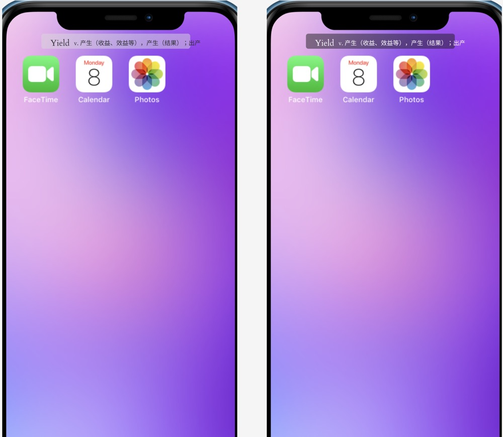
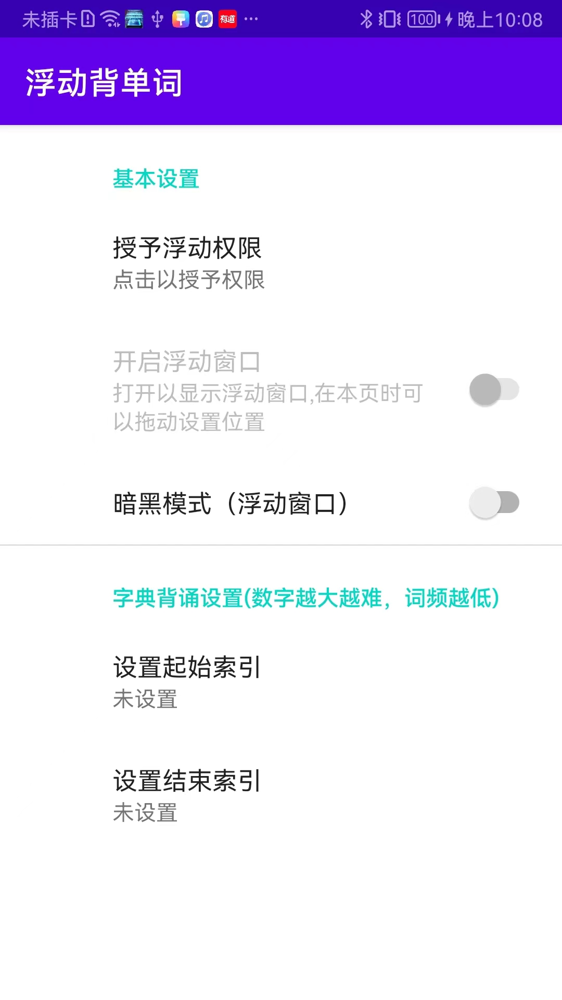
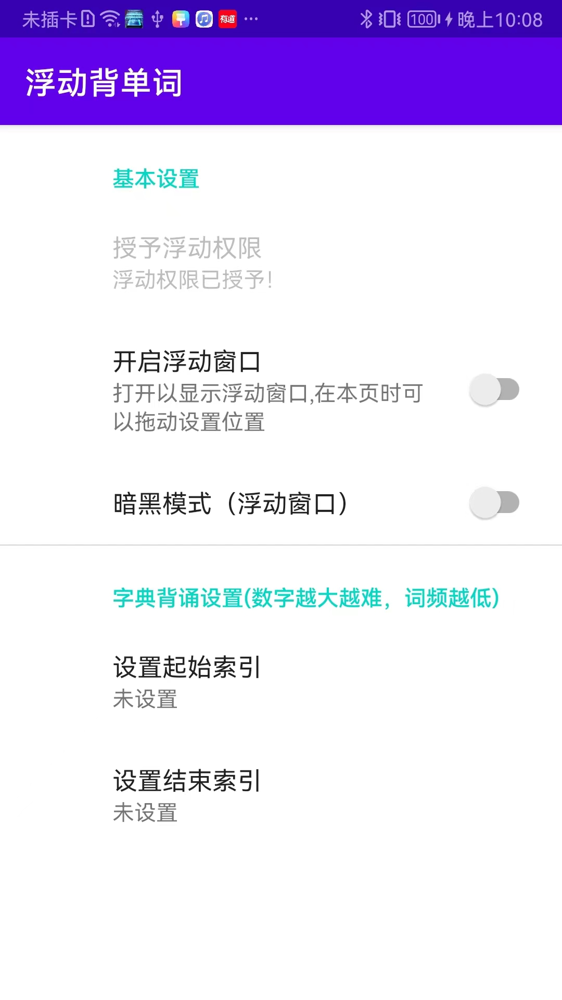
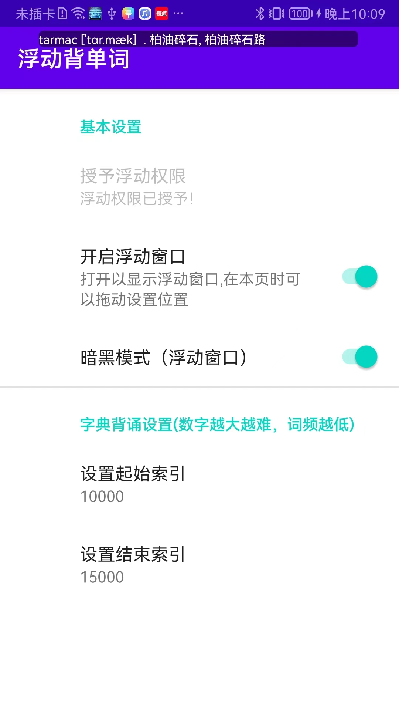

# Floating Dictionary

I always want to have a dictionary to have the feature of reciting words with a floating window,
which can be always on top of other windows.
Then I can recite words while I am doing other things.
So I made this one.

# MVP (Minimum Viable Product)

The first edition of this dictionary is a MVP (Minimum Viable Product).I want to make it very simple
but can prefectly meet my needs.
It has the basic features below:

- A floating window to show the meaning of a word. the floating window can be always on top of other
  windows. and the words would stay for a while before change to the next word.
- A word list to recite. I choose to use the frequency order to show the words. while I can
  configure the index of start and end.
- The words shown in the floating window can be recited in random order or in order. but it should
  record the shown words and not show them again until all the words in the list have been shown.
  the records would be reset after the word list configuration is changed.

#### Prototype

#### Run

- unzip the `dict.sqlite.zip` file in the assets folder with name `dict.sqlite`.(The original file is too large to upload to
  github, and I do not want to up git lfs.)
- The the project can be build successfully.

#### How to use it
- When you first install it, it basically only has the setting page. you need click the `Grant Floating Permission` to go to the setting page to grant the overlay permission.

- Switch on the permission.

- Now the permission is granted.

- You can change the theme of the floating view.

|  Ligth Mode  | Dark Mode  |
|:------------:|:--------------:|
| | |

- If you do not set the index. it will start from the first word (orderd by the frequency). So it is recommended to set the start and end index.

- Now you can recite the words anytime, even when you are browsing the tiktok.

# References

#### Dictionary sqlite database

- The dictionary sqlite database is from https://github.com/dyeeee/English-Chinese-Dictionary.

|  字段名  | 字段说明  |
|  ----  | ----  |
| wordID  | 单词ID，主键 |
| wordContent  | 单词 |
| phonetic_EN  | 英式英标 |
| phonetic_US  | 美式英标 |
| definition  | 英英释义 |
| translation  | 英含释义 |
| wordTags  | 单词标记（四六级/雅思等） |
| wordExchanges  | 时态复数等词形变换 |
| bncLevel  | 英国国家语料库词频顺序（1为频率最高） |
| frqLevel  | 当代语料库词频顺序（1为频率最高） |
| collinsLevel  | 柯林斯星级（1-5星，5星为频率最高） |
| oxfordLevel  | 是否牛津三千核心词汇 |
| exampleSentences  | 例句 |

#### Read sqlite file in assets folder

- https://github.com/jgilfelt/android-sqlite-asset-helper

#### Floating

- ~~https://github.com/princekin-f/EasyFloat~~ It can not meet my needs perfectly. So I only extract some of it.

# 浮动背单词

我一直想要一个能够在浮动窗口中背单词的词典，可以一直显示在其他窗口的最上层，这样我就可以在做其他事情的同时背单词。所以我做了这个。

# 最小可行产品原型

这个词典的第一个版本是一个MVP（最小可行产品）。我希望它非常简单，但完全满足我的需求。它具有以下基本功能：

- 一个浮动窗口来显示单词的含义。浮动窗口可以一直显示在其他窗口的最上层，并且单词会在显示一段时间后更换为下一个单词。
- 一个单词列表来背诵。我选择使用频率顺序来显示单词，同时可以配置起始和结束索引。
- 在浮动窗口中显示的单词可以按随机顺序或顺序背诵。但是它应该记录已显示的单词并在所有单词都显示过后不再显示它们。在更改单词列表配置后，记录将被重置。

#### 原型

#### 运行

- 在assets文件夹中解压`dict.sqlite.zip`文件为`dict.sqlite`。（原始文件太大无法上传到github，而且我不想使用git lfs。）
- 然后就可以build啦。

#### How to use it
- 当您第一次安装时，基本上只有设置页面。您需要点击“授予浮动权限”进入设置页面以授予悬浮窗口权限。

- 打开权限开关。

- 现在权限已经被授予。

- 您可以更改浮动视图的主题。

|  浅色模式  | 深色模式  |
|:------------:|:--------------:|
| | |

- 如果不设置索引。它将从第一个单词开始(按频率排序)。因此建议设置起始索引和结束索引。

- 现在你可以随时背诵单词，比如边刷抖音边背。

